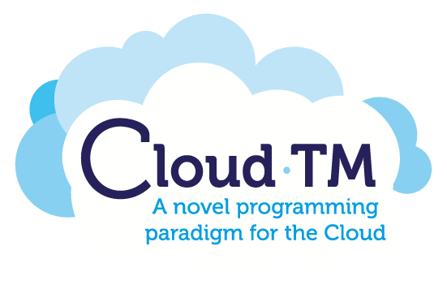

# Cloud-TM Features

The Cloud-TM Project was conducted in the scope of the Specific Targeted Research Project (STReP) Cloud-TM, which is co-financed by the European Commission through the contract no. 257784. This project addressed the promise of infinite scalability, while catalyzing much of the recent hype about Cloud Computing, which requires handling the lack of programming paradigms and abstractions capable of bringing the power of parallel programming into the hands of ordinary programmers. For this, Cloud-TM precisely this issue by developing Cloud-TM (Transactional Memory), a self-optimizing middleware platform aimed at simplifying the development and administration of applications deployed on large scale Cloud Computing infrastructures.

  

Given the high demands for scalability in large clusters, and other particularities of the Cloud-TM requirements, we have conducted some specific extensions to Fénix Framework targeting only Cloud-TM. The Fénix Framework was designed to be completely backend-independent, i.e., pluggable on different data platforms. However, this precludes some advanced facilities that were crucial for very large and scalable deployments, such as those enabled by Cloud-TM. Therefore some of these extensions were not fully backend-independent, being common only to the data platforms used in the project, for which reason you may that the Cloud-TM branch of the framework is more evolved and complex than the master branch. 

The JavaDoc for the Cloud-TM Fénix Framework is available in [JavaDoc][JavaDoc]. In the following we document some additional features of the framework only available in the branch of the Cloud-TM project:

* [Data Access Patterns][DAP]
* [Pluggable Collections][Collections]
* [Indexed Relations][Indexes]
* [Transaction Introspector][Introspector]
* [Hibernate Search][Search]
* [User-provided Locality Hints][LocalityHints]
* [Programmer-defined Caching using L2][L2Cache]
* [Programmer-defined Transactional Classes][TxClasses]

The Cloud-TM Project is Copyright 2010-2013 Cloud-TM Consortium. It is free software, and may be redistributed under the terms specified in the licensing files distributed along with the source code. Check out the [Official Website][WebSite] for more information. 

[DAP]: DAP.html
[Collections]: Collections.html
[Indexes]: Indexes.html
[Introspector]: Introspector.html
[Search]: Search.html
[LocalityHints]: LocalityHints.html
[L2Cache]: L2Cache.html
[TxClasses]: TxClasses.html
[JavaDoc]: JavaDoc.html
[WebSite]: http://www.cloudtm.eu
